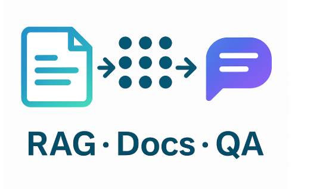

<p align="left">
  
</p>


# Module 4 – Retrieval-Augmented Generation (RAG)

## 🚀 Quick Summary
Built a **RAG pipeline** that turns my resume/portfolio into a searchable knowledge base and answers questions with real citations.  
Implements **chunking → embeddings → vector index → retrieval → LLM generation** via LangChain.  
Runs with **OpenAI** or a **local vLLM** endpoint; supports **FAISS** or **Chroma**.  
Demonstrates **NLP preprocessing, vector search, LLM integration, and evaluation** of retrieval quality.

---

## 📖 Project Description
Modern LLMs are powerful but can be out-of-date or hallucinate. This project makes answers **grounded** in my actual documents by combining LLMs with a **real-time retrieval layer**.  
It converts resume and portfolio files into embeddings, indexes them in a vector DB, retrieves the most relevant chunks, and **augments** LLM responses with those snippets (and optional citations). The repo also includes a **Python class demo** that walks through the full pipeline and simple evaluation.

---

## 🎯 Objectives
- **Ingestion & Chunking**: Load resume (PDF/DOCX) + extras; split via `RecursiveCharacterTextSplitter` (~500 tokens, ~10% overlap).
- **Embeddings & Indexing**: Create embeddings (OpenAI or HF) and store in **FAISS** or **Chroma**.
- **Retrieval & QA**: Build **LangChain RetrievalQA** to fetch top-k chunks and generate answers with references.
- **Evaluation**: Probe with good/bad/adversarial queries; compute simple metrics (e.g., context recall, accuracy proxy) and discuss nDCG/attribution.
- **(Optional) Local Serving**: Connect to **vLLM** (e.g., Zephyr-7B) via OpenAI-compatible endpoint for GPU inference.

---

## 🛠️ Tech Stack
- **Language**: Python  
- **Frameworks/Libraries**: LangChain, FAISS or Chroma, OpenAI API / vLLM (OpenAI-compatible), Hugging Face  
- **Key Modules**:  
  - **Embeddings**: `OpenAIEmbeddings` or `HuggingFaceEmbeddings`  
  - **Retrieval**: `FAISS` / `Chroma` vector stores  
  - **RAG Chain**: `RetrievalQA` (LangChain)  
  - **Utilities**: `dotenv`, `pypdf`, `TextLoader`, `RecursiveCharacterTextSplitter`  
- **(GPU Option)**: vLLM server (OpenAI-compatible), sentence-transformers for local embeddings

---

## 🔥 Architecture / Workflow Diagram
flowchart LR
  A[Docs]-->B[Chunk]
  B-->C[Embeddings]
  C-->D[FAISS/Chroma]
  E[Query]-->F[Retriever(k)]
  D-->F
  F-->G[LLM Generate + Cite]

---

## 📂 Deliverables
- `class_4.py` / `notebooks/` — end-to-end RAG pipeline (load → chunk → embed → index → retrieve → answer → evaluate)  
- `resume.pdf` + `portfolio_notes.txt` — sample inputs for the **Resume AI** use case  
- `vector_index/` — persisted FAISS/Chroma index (if saved)  
- `examples/qa_samples.jsonl` — example questions and answers  
- `reports/eval_stats.md` — notes on retrieval quality (e.g., accuracy proxy, recall, improvement ideas)

---


## 🔥 How to Run / Quick Start 
pip install -r requirements.txt
python rag_run.py --resume resume.pdf --notes portfolio.txt --k 3

---
## 🌟 Highlights
- **End-to-end RAG** with clear, modular steps (easy to swap embeddings/DBs/LLMs).  
- **Grounded answers** with retrieved snippets (reduces hallucinations).  
- **Local or cloud**: works with OpenAI **or** local **vLLM** for cost/privacy.  
- **Evaluation-aware**: provides a baseline harness and discusses metrics (recall, nDCG, attribution).  
- **Career-ready demo**: “**My Resume AI**” answers recruiter-style questions from real documents.

---

## 🧭 Typical Workflow
1. **Load Docs**: `PyPDFLoader("./resume.pdf")` + `TextLoader("./portfolio_notes.txt")`  
2. **Split**: `RecursiveCharacterTextSplitter(chunk_size=500, chunk_overlap=50)`  
3. **Embed & Index**: `FAISS.from_documents(chunks, OpenAIEmbeddings(...))` (or `Chroma.from_documents`)  
4. **RAG Chain**:  
   ```python
   agent = RetrievalQA.from_chain_type(
     llm=OpenAI(temperature=0),  # or ChatOpenAI(openai_api_base="http://localhost:8000/v1", ...)

---
## 🌟 Skills Demonstrated
RAG design；vector DB；prompting & evaluation；LLM deployment patterns。

---


     chain_type="stuff",
     retriever=vectorstore.as_retriever(search_kwargs={"k": 3})
   )
